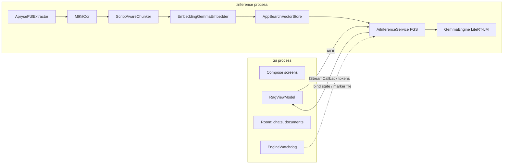

# On-Device Android RAG: Final Implementation Plan

## Locked Decisions

* **LLM Runtime:** `com.google.ai.edge.litertlm:litertlm-android:0.11.x`. API: `Engine(EngineConfig(modelPath, backend, maxNumTokens = 8192, cacheDir))`, `engine.initialize()`, `engine.createConversation(ConversationConfig(...))`, `conversation.sendMessageAsync(msg): Flow<Message>`, `conversation.cancelProcess()`. No manual chat-template tokens; no `<|think|>` in the system instruction.
* **Models:** Gemma 4 E2B `.litertlm` (2.58 GB, default), E4B (3.65 GB, shown only on >= 12 GB RAM). Hosted on your own CDN (HF is gated); `DownloadManager` to app-external dir, then one streaming pass that SHA-256-verifies and copies into `filesDir/models/`, then deletes the download.
* **Embeddings:** `litert-community/embeddinggemma-300m`, `seq512` `.tflite` variant, LiteRT `CompiledModel` (`com.google.ai.edge.litert:litert:2.x`), SentencePiece tokenizer (DJL `ai.djl.sentencepiece` first; pure-Kotlin fallback). Output truncated 768 -> 512 and L2-normalised. Prefixes: `title: none | text: ` (chunks), `task: search result | query: ` (queries). Model signature `embeddinggemma-300m-seq512-512d`.
* **Vector Store:** `androidx.appsearch:appsearch:1.1.0` + `appsearch-local-storage:1.1.0` + `appsearch-compiler:1.1.0` (`kapt`). `LocalStorage`, owned exclusively by the `:inference` process, one session object. `@Document.EmbeddingProperty(indexingType = SIMILARITY, quantizationType = QUANTIZATION_TYPE_8_BIT)` with `@OptIn(ExperimentalAppSearchApi::class)`. Namespace = content hash of the PDF.
* **PDF:** `com.pdftron:pdftron:12.1.0` (licensed), `TextExtractor` with bounding boxes; own column-clustering heuristic for tables. OCR fallback via ML Kit `text-recognition` + `-chinese` + `-japanese` + `-korean` (all 16.0.1), triggered when page text < 50 chars and page has image XObjects; recogniser chosen once per document.
* **Process Model:** `:ui` (Compose, chat transcript persistence in Room, model manager) and `:inference` (foreground service; Engine, Embedder, Apryse, AppSearch). AIDL with `@Parcelize` parcelables; token stream tagged with `generationId`.
* **Build:** `arm64-v8a` only (with `x86_64` enabled for debug builds); `minSdk 29`, `targetSdk 35`; `packaging { jniLibs { pickFirsts += "**/libLiteRt.so" } }`; 16 KB ELF alignment check in CI; `kotlin-kapt`; `androidx.concurrent:concurrent-futures-ktx`.

---

## Architecture

---

## Module and File Layout (Single App Module)

* **Build & Config:**
  * `app/build.gradle.kts`, `settings.gradle.kts` (with `google`, `mavenCentral`, and `https://pdftron-maven.s3.amazonaws.com/release`), `gradle/libs.versions.toml`
* **AIDL (`src/main/aidl/...`):**
  * `IAiInferenceService.aidl`, `IStreamCallback.aidl`, `IIndexingCallback.aidl`, `Citation.aidl`, `IndexingProgress.aidl`
* **Core:**
  * `core/process/ProcessGuard.kt` (branch `Application.onCreate` by process name)
  * `core/model/Citation.kt`, `IndexingProgress.kt`, `ChatMessage.kt` (`@Parcelize`)
* **Inference Service & LLM:**
  * `inference/service/AiInferenceService.kt` (FGS `dataSync`, `android:process=":inference"`, `exported=false`)
  * `inference/llm/GemmaEngine.kt` (init, backend selection via `gpu_disabled.marker`, per-turn `Conversation`, cancel, close)
  * `inference/llm/ContextAssembler.kt` (token budget ~4k, drop lowest-ranked, adjacent-chunk dedupe, citation ids)
* **Embedding & Tokenization:**
  * `inference/embed/EmbeddingGemmaEmbedder.kt`, `SentencePieceTokenizer.kt`
* **PDF & OCR Ingestion:**
  * `inference/pdf/AprysePdfExtractor.kt`, `PageLayout.kt` (words+bounds), `TableClusterer.kt`, `HeaderFooterStripper.kt`
  * `inference/ocr/MlKitOcr.kt`, `ScriptDetector.kt` (Unicode script ratio, per-document decision)
  * `inference/chunk/ScriptAwareChunker.kt` (CJK 300-330 chars, European 1000-1200, 10-15% overlap, table-header injection, `BreakIterator`)
* **Vector Store:**
  * `inference/store/PdfChunkDocument.kt`, `AppSearchVectorStore.kt` (schema set/migrate, batched `putAsync` x100, `requestFlushAsync()` every 500, hybrid search, `removeByNamespace`)
* **Use Cases:**
  * `inference/index/IndexPdfUseCase.kt`, `inference/chat/AnswerQuestionUseCase.kt`
* **UI Layer:**
  * `ui/MainActivity.kt`, `RagViewModel.kt`, `ServiceConnectionManager.kt`, `EngineWatchdog.kt`
  * `ui/data/ChatDatabase.kt` (Room: `documents(hash, name, pages, indexedAt)`, `messages`)
  * `ui/screens/ModelManagerScreen.kt`, `DocumentListScreen.kt`, `IndexingScreen.kt`, `ChatScreen.kt`, `CitationSheet.kt`, `theme/`
  * `ui/download/ModelDownloadManager.kt` (`DownloadManager` + completion receiver + verify-and-copy worker), `ModelCatalog.kt` (`name`, `url`, `size`, `sha256`, `minRamGb`)
* **Manifest (`AndroidManifest.xml`):**
  * Permissions: `FOREGROUND_SERVICE`, `FOREGROUND_SERVICE_DATA_SYNC`, `POST_NOTIFICATIONS`, `INTERNET`
  * Native libs: `<uses-native-library android:name="libOpenCL.so" android:required="false"/>` and `libvndksupport.so` inside `<application>`
  * `pdftronLicenseKey` placeholder

---

## Key Contracts

* **Hybrid Query (`AppSearchVectorStore.search(docHash, queryText, queryVec, topK)`):**
  * `SearchSpec.Builder().setListFilterQueryLanguageEnabled(true).addSearchStringParameters(listOf(queryText)).addEmbeddingParameters(listOf(queryVec)).setDefaultEmbeddingSearchMetricType(EMBEDDING_SEARCH_METRIC_TYPE_COSINE).setRankingStrategy("sum(this.matchedSemanticScores(getEmbeddingParameter(0))) + 0.05 * this.relevanceScore()").addFilterNamespaces(docHash).setResultCountPerPage(topK).addProjection("PdfChunkDocument", listOf("text","pageNumber","chunkIndex"))`
  * Query string: `"getSearchStringParameter(0) OR semanticSearch(getEmbeddingParameter(0), 0.3, 1)"` (0.3 is a tunable constant)
  * Gated on `Features.isFeatureSupported` for:
    * `SCHEMA_EMBEDDING_PROPERTY_CONFIG`
    * `SEARCH_SPEC_SEARCH_STRING_PARAMETERS`
    * `SEARCH_SPEC_ADVANCED_RANKING_EXPRESSION`
    * `LIST_FILTER_QUERY_LANGUAGE`
* **Chat Turn:**
  * Fresh `Conversation` per question with `systemInstruction` (lean RAG rules, refuse out-of-document) and `initialMessages = last 3-4 QA pairs` with chunks stripped.
  * User message = question + assembled context.
  * Store answer text and citation ids in Room.
* **GPU Fallback:**
  * Service reads `filesDir/gpu_disabled.marker`.
  * `:ui` watchdog writes it atomically (`temp` + `renameTo`, timestamp inside) on `onServiceDisconnected` / `DeadObjectException` or no init progress for 120 s (no cache) / 30 s (cache present), then restarts service.
  * Settings toggle *"Retry GPU"* deletes the marker.
* **Device Gating:**
  * `ActivityManager.MemoryInfo.totalMem`: `< 6 GB` refuse; `6-8 GB` E2B only, chat blocked while indexing; `>= 12 GB` show E4B.
  * Free-space pre-flight: 2x model size for download+copy window; 1 GB before indexing.
* **Thermal:**
  * `OnThermalStatusChangedListener` in service; `SEVERE` pauses indexing and reports a badge; generation is not throttled.

---

## Phases

* **Phase 0 - Spikes (Throwaway module, 3-5 days):**
  1. `litertlm 0.11.x` + `litert 2.x` packaging and runtime coexistence.
  2. `EmbeddingGemma` on device: tokenizer parity on 50 CJK/Latin strings vs Python, latency CPU/GPU.
  3. `AppSearch 1.1.0` feature-support log + hybrid query on a real device incl. Japanese/Chinese keyword hits.
  4. `Gemma 4 E2B` GPU init on two weakest target devices, forced-crash fallback.
  5. Apryse `TextExtractor` output on CJK, multi-column, and tabular PDFs.
  *(Any red result reopens the corresponding decision before Phase 1).*
* **Phase 1 - Skeleton:**
  * Project, Gradle, manifest, process guard, AIDL, FGS with ping, Room, Compose shell, model catalog + download/verify/copy, local `.litertlm` picker.
* **Phase 2 - Generation:**
  * `GemmaEngine`, backend selection + marker, watchdog, streaming with `generationId`, cancel, `ChatScreen` without retrieval.
* **Phase 3 - Ingestion:**
  * Apryse extraction, header/footer strip, table clustering, OCR routing, chunker, embedder, AppSearch schema and batching, `IndexPdfUseCase` with progress + cancel (partial index removed), `IndexingScreen`, delete path.
* **Phase 4 - Retrieval + RAG:**
  * Hybrid search, `ContextAssembler`, `AnswerQuestionUseCase`, citation chips + sheet via AIDL `chunkId`, chat history handling.
* **Phase 5 - Hardening:**
  * Device/RAM gating, storage pre-flight, thermal, LMK recovery (*"Reloading model"*), 16 KB CI check, eval harness and tuning of similarity floor and ranking weight.

---

## Verification

* **Unit:** Chunker boundaries/overlap/page tags for CJK and European text; table header injection; tokenizer parity fixture; context assembler budget and pruning; script detector.
* **Instrumented (Device):** AppSearch put/search/remove with synthetic vectors and namespace isolation; feature-support assertions; embedder cosine sanity (paraphrase > unrelated).
* **Manual:** 100- and 500-page PDFs (text, scanned, CJK, tabular); questions from pages ~5/250/480 with correct `[Page X]`; out-of-document refusal; cancel mid-index and mid-generation; forced GPU failure -> CPU; background + return -> model reload; 6 GB and 12 GB devices.
* **Eval Harness:** ~30 Q/A per language, `page-hit@5` logged per build.
