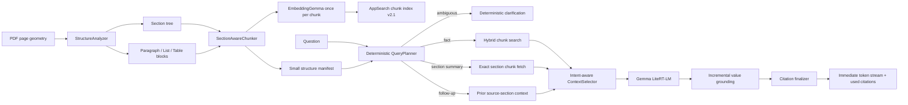

# Single-PDF On-Device RAG V2.1 Plan

## 1. Objective

Make question answering over one indexed PDF dependable before adding cross-document retrieval.
All parsing, embeddings, storage, retrieval, planning, generation, evaluation, and chat history stay
on the Android device. No server reranker, query rewriter, summarizer, or evaluator is introduced.

The product promise is:

1. find the intended evidence, including a named or implied section;
2. start showing a grounded answer quickly;
3. cite the actual supporting page and section;
4. refuse when the PDF does not contain the answer;
5. identify ambiguity instead of silently choosing between repeated sections;
6. preserve these behaviours through follow-ups, cancellation, and process recovery.

This plan deliberately excludes cross-PDF questions. It does not exclude having several PDFs stored
on the device; each question is still scoped to exactly one `docHash`.

## 2. Historical Baseline and Confirmed Failure

The current foundation is sound: Apryse layout extraction, OCR fallback, tokenizer-bounded chunks,
EmbeddingGemma, AppSearch hybrid retrieval, Gemma generation, citations, process isolation, GPU
fallback, cancellation, and partial-index rollback all work on device.

Before V2.1, only 5 of 15 Pixel 10 answers were fully acceptable. Median model TTFT was 2.137
seconds, while median user-visible first text was 6.259 seconds because RAG output was buffered.
The implemented V2.1 result is recorded in
[`SINGLE_PDF_BASELINE_RESULTS.md`](SINGLE_PDF_BASELINE_RESULTS.md): retrieval 15/15 and answer checks
15/15, with exact summary evidence visible in 340–665 ms.

The query `summarize concrete mix` exposes the next architectural gap. The PDF contains two valid
headings with that title: specification 03300 section 2.05 on page 17, and specification 03310
section 2.02 beginning on page 60. Retrieval silently selected pages 60, 64, and 65 instead of
asking for clarification. Even queries containing the explicit specification and section number
missed the requested section.

Root causes:

- headings are not represented as a first-class segment or indexed entity;
- section identity does not include the parent specification, even though local numbers and titles
  repeat within one PDF;
- compound identifiers such as `2.05` are split into short pieces and discarded by keyword parsing;
- a section heading is not guaranteed to be attached to its following paragraph, list, or table;
- numbered specification clauses can be mistaken for two-column tables;
- table labels and value columns can land in different chunks, losing row relationships;
- hybrid retrieval treats broad terms independently and has no section-title confidence signal;
- the context assembler accepts only four globally ranked chunks, which is appropriate for fact
  lookup but not for summarising a section;
- citation chips represent all supplied context, not the chunks actually used by the answer;
- integer and identifier copying can fail (`5000` became `50`, `03300` became `030`);
- RAG output is currently buffered until completion for numeric correction, so model TTFT is not
  the user's visible TTFT.

No production rule may mention `concrete`, `2.05`, page 17, or any phrase from the test PDF.

## 3. Target Architecture



The planner is deterministic Kotlin. It must not add a second Gemma call before retrieval because
that would materially increase latency and introduce another failure mode. A high-confidence,
unique section-summary match also skips query embedding; ambiguous matches return clarification
without invoking either embedding or Gemma.

## 4. Ingestion and Structure Changes

### 4.1 Preserve typographic signals

Extend `WordBox`/`LineBox` with the geometry already available during extraction:

- line height and baseline;
- indentation and left/right margins;
- whether a line is short relative to page width;
- font/style information when Apryse exposes it reliably; geometry remains the fallback.

Do not build heading detection from English words. Detect headings using layout, numbering shape,
short-line length, surrounding whitespace, and consistency with other headings in the PDF.

Aggregate multi-line headings before classification. A short heading candidate may absorb one or
more immediately following lines when indentation/alignment, font or line height, and vertical gap
are compatible. Do not merge a continuation that ends like body prose or whose geometry matches
the following paragraph instead. Keep synthetic tests for wrapped titles, all-caps titles, numbered
titles, and false positives at page boundaries.

### 4.2 Replace the two-type segment model

Change `Segment` from only `Paragraph` and `Table` to:

```text
Heading(number, title, level)
Paragraph(text)
ListBlock(items: [label, text])
Table(caption, columnHeaders, rows)
```

`StructureAnalyzer` owns heading and list recognition. `TableClusterer` should only classify tables.
A two-column block whose first column is predominantly enumerators (`A.`, `1.`, `(a)`) is a list,
not a table. Two-column tables require stronger repeated data-column evidence; three or more stable
columns remain a strong table signal.

`ListBlock` items and `Table` rows are logical units, not arrays of unrelated text cells. A list
label cannot be separated from its item text, and a row label cannot be separated from the values
in that row. Chunking may split a large table only at row boundaries. A continued table repeats its
caption and column headers, including when the continuation starts on another page.

### 4.3 Build a section tree

Maintain a stack of detected headings while walking pages. Each content block receives:

- `specificationNumber`, when present in the parent heading hierarchy;
- `sectionNumber` and `sectionTitle`;
- `sectionKey = documentHash + specificationNumber + sectionNumber + normalizedTitle + ordinal`;
- `sectionId`, a stable hash of `sectionKey` (duplicate numbers or titles must not collide);
- `sectionPath`, for example `CAST-IN-PLACE CONCRETE > 2.05 CONCRETE MIX`;
- `positionInSection` and `contentKind`;
- its exact physical PDF page.

A section may span pages, but an individual chunk must not cross a page. This preserves unambiguous
page citations. Cross-page content uses explicit `continuesFromChunkId`/`continuesToChunkId`
relationships (or an equivalent multi-span source model); text from page 17 must never be copied
into a chunk cited as page 18. Context selection may place continuation chunks together while each
retains its own page metadata.

### 4.4 Section-aware chunks

Store two forms of text:

- `bodyText`: the original content shown in the citation sheet;
- `retrievalText`: section path plus body content, used for embedding and lexical indexing.

Every list/table continuation chunk repeats its section path and its real column headers. A section
heading must never be removed merely because it is shorter than `minKeepChars`.

Preserve compound identifiers as atomic searchable terms in addition to normal words. Examples
include `2.05`, `03300`, `ASTM C94`, `ACI 301`, hyphenated clause IDs, and dotted subsection paths.
Identifier atoms are not subject to the general three-character keyword minimum.

Use EmbeddingGemma's title field instead of `title: none`:

```text
title: <section path> | text: <body text>
```

Change the embedding signature to a V2.1 value so old and new vectors cannot be mixed.

## 5. Storage and Reindexing

### 5.1 AppSearch chunk schema V2.1

Add these fields to `PdfChunkDocument`:

- `bodyText` and indexed `retrievalText`;
- indexed `sectionTitle` and stored `sectionPath`;
- exact-match `sectionId`;
- indexed exact identifier atoms, including `specificationNumber` and `sectionNumber`;
- `positionInSection`, `contentKind`, and continuation chunk IDs;
- `indexNamespace`, `indexVersion`, and the V2.1 embedding signature.

Add a lightweight per-document structure manifest containing section IDs, normalized titles,
levels, specification/section identifiers, page spans, ordered chunk IDs, continuation edges,
token counts, and an optional normalized centroid computed
from the section's existing chunk embeddings. Computing a centroid adds no model invocation during
indexing. Persist the manifest in a compact private-file format and keep one active document
manifest in inference-process memory. A section summary can then fetch known chunk IDs directly
instead of running a second vector search.

Fetch manifest-selected chunks using `getByDocumentIdAsync` in bounded batches. Treat missing IDs
as an index-integrity error, tolerate API results arriving out of order, and restore manifest order
before context selection. Direct fetch removes ranking work; its latency must still be measured on
the target device rather than assumed.

Validate manifest version, active namespace, ordered ID uniqueness, and referenced chunk presence
when loading it. A failed direct fetch must be converted into a typed `ManifestIntegrityError`, not
an unhandled exception. For fact lookup, degrade to the normal hybrid search in the active namespace
and record the fallback. For a section summary, a constrained hybrid search may be used only if it
can prove the expected section coverage; otherwise return a safe `document index needs repair`
result and offer reindexing rather than presenting a partial result as a complete summary.

### 5.2 Explicit index version

Add `indexVersion` and `activeIndexNamespace` to `DocumentEntity` using a real Room migration.
Remove reliance on destructive Room migration for this change. On upgrade:

- preserve the PDF and chat messages;
- mark a V1 document as `REINDEX_REQUIRED`;
- rebuild only that document namespace when the user opens or explicitly reindexes it;
- never mix V1 and V2.1 chunks.

Reindex into a staging namespace such as `<docHash>:v2.1:<buildId>`. Publish the new manifest and
active namespace only after every chunk and the AppSearch flush succeed, then delete the previous
namespace. A failed or cancelled rebuild must leave the last complete index usable.

Chunk IDs must include the index version. Persist the citation index version with chat messages so
old messages can display `citation unavailable after reindex` rather than opening the wrong chunk.
Every citation and manifest reference must carry `indexNamespace` explicitly; never reconstruct it
with string parsing such as `chunkId.substringBefore(':')`, because versioned namespaces themselves
contain colons.

## 6. Fast On-Device Query Planning

Introduce `QueryPlanner`, returning:

```text
QuestionPlan(
  intent = FACT | SECTION_SUMMARY | DOCUMENT_OVERVIEW | AMBIGUOUS_SECTION,
  subjectText,
  explicitSpecificationNumber?,
  explicitSectionNumber?,
  resolvedSectionId?,
  candidateSectionIds,
  sectionConfidence,
  inheritedSectionId?
)
```

Planning is local string normalization plus scoring against the small section manifest. It should
take less than 10 ms and perform no model inference. Use only Kotlin/JVM primitives: precompiled
`Regex`, `java.text.Normalizer`, `Locale.ROOT`, collection/string operations, and a small internal
bounded edit-distance function. Do not add a third-party string-matching dependency.

### 6.1 Section resolution

Normalize Unicode, case, punctuation, and instruction words such as `summarize`, `overview`, and
`key points`. Maintain equivalents for the currently supported UI languages. Extract compound
identifiers before punctuation tokenization and preserve them as atoms, so `2.05` does not become
the discarded tokens `2` and `05` and a leading-zero identifier such as `03300` remains intact.

Score candidate headings using:

- exact normalized title, specification-number, or section-number match;
- exact combined identity match such as `03300 section 2.05`;
- ordered token/phrase overlap;
- title-token coverage;
- cosine similarity with stored section centroids only when lexical confidence is insufficient.

The query embedding used for normal retrieval is reused for centroid scoring; section resolution
must never require an additional embedding or model invocation.

Resolve against the globally unique specification/section identity, not title alone. Select a
section only when the best score passes a threshold and has a safe margin over the second candidate.
If a section-summary request has multiple plausible candidates, return a deterministic
clarification listing each candidate's specification number, section number, title, and starting
page. Do not call the embedder or Gemma for that response. A low-confidence fact question may fall
back to global retrieval, but the fallback must not silently pretend that an ambiguous section was
resolved.

### 6.2 Retrieval paths

**Fact lookup**

- Embed the question once.
- Run the existing hybrid chunk search.
- If the question names a confidently resolved specification/section, constrain retrieval to that
  `sectionId` before ranking.
- Prefer exact identifier atoms, numbers, and section-title matches.
- Select diverse primary evidence, then expand structurally related evidence. Include a linked
  list item, table header/row, or continuation chunk even when its independent score is below the
  relative-score floor, provided the combined selection fits the token budget.
- Deduplicate structural neighbors by `chunkId` first, then remove only an exact normalized overlap
  at adjacent text boundaries. Preserve separate page/source spans and never fuzzy-deduplicate
  similar clauses, since repeated specification language may carry different requirements.
- Default context target: 1,600 tokens and at most four primary chunks.

**Section summary**

- Resolve the section from the manifest.
- For a confidently unique exact title or identifier match, skip query embedding and fetch the
  manifest's ordered chunk IDs directly.
- Include all chunks when the section fits the summary budget.
- For a long section, allocate coverage across child headings, lists, tables, start, and end rather
  than taking four globally ranked chunks.
- Initial context target: 2,800 tokens, capped by measured Pixel prefill latency.

**Document overview**

- Use the structural outline and representative content from each top-level section.
- This is a second milestone after section summaries pass. Do not describe it as a full detailed
  summary when the entire PDF cannot fit the context window.

### 6.3 Follow-ups without trusting prior answers

Persist the resolved `sectionId` and source chunk IDs for each completed turn. A reference such as
`what about hot weather?` may inherit the previous source section. A clear topic switch runs normal
global retrieval. Inheritance comes from prior source metadata, never from trusting the previous
model answer. Continue to exclude previous model answers from RAG evidence.

## 7. Context and Citation Contracts

Replace one global `ContextAssembler` policy with an intent-aware `ContextSelector`.

Each prompt excerpt includes:

```text
[E1]
Specification: 03300
Section: 2.05 CONCRETE MIX
Page: 17
Content: ...
```

The section path is retrieval/generation context, not a substitute for the original source text.
The model may cite only stable excerpt IDs such as `[E1]`. A `CitationFinalizer` maps those IDs to
`CitationRef(excerptId, chunkId, indexNamespace, pageNumber, sectionPath)` and persists/displays
only citations actually referenced by the final answer. Retrieved candidates remain available for
diagnostics but are not automatically shown as citation chips. A refusal with no used evidence has
no unrelated citation chips.

Citation chips resolve to exact pages and display the unmodified `bodyText` plus the section
breadcrumb. Invalid or unknown excerpt IDs are removed and recorded as a grounding failure; they
must never be mapped to the nearest available page.

For summaries, define expected coverage items rather than expecting one exact wording. Generation
must not claim that an entire section was summarized if chunks were omitted due to the budget; it
should say that it is providing key points.

## 8. Restore User-Visible Streaming and Ground Values

The existing numeric safeguard buffers the whole RAG answer until `onDone`. Replace it with an
incremental `GroundingStreamFilter`:

- build an allowed-value lexicon only from selected source excerpts (the user's question is not
  evidence), including integers,
  leading-zero identifiers, decimals, percentages, signed values, ranges, fractions, units, dates,
  dotted section numbers, and compound specification/standard IDs;
- retain only the current unfinished candidate value token and citation marker;
- when a delimiter completes a candidate, require an exact normalized match in that lexicon;
- permit prefix correction only when there is exactly one same-form source candidate and compatible
  adjacent unit/context; otherwise stop the unsupported token or sentence and surface a grounding
  failure instead of guessing;
- emit all safe preceding text immediately;
- flush the small remainder on completion or cancellation.

List markers, ordinal punctuation, and valid citation IDs are parsed structurally rather than
treated as factual values. This keeps value protection while making visible TTFT closely match
model TTFT. Pure unit tests must cover arbitrarily fragmented callbacks and at least `0.55`, `5000`,
`03300`, `2.05`, `4,500.50`, `10-15%`, negative values, fractions, dates, `1.` as a list marker, and
citation markers.

Build the lexicon once per answer in the inference process, not on the UI thread. Normalize it into
hash sets grouped by token form so steady-state validation is bounded and near `O(1)` per completed
candidate. Cap candidate length and buffered characters, avoid backtracking-heavy regexes, and pass
tokens to the UI only after the filter accepts them. Add exhaustive table-driven tests, randomized
callback-boundary tests, and a long-stream benchmark that enforces both maximum buffer size and a
small CPU-time budget.

## 9. Single-PDF Evaluation Strategy

Create two suites for the current PDF. The captured V1 baseline and repeatable 15-question device
suite are in [`SINGLE_PDF_BASELINE_RESULTS.md`](SINGLE_PDF_BASELINE_RESULTS.md) and
`app/src/androidTest/assets/single_pdf_baseline.json`. Document-specific questions belong only in
test assets; production code remains generic.

### 9.1 Fast retrieval suite

Run at least 50 questions with the real on-device embedding and existing index:

- 15 precise facts and numeric values;
- 10 section-title/section-summary formulations;
- 8 list and table lookups;
- 6 comparisons or questions needing multiple chunks;
- 6 follow-ups, including topic switches;
- 5 plausible but absent questions.

Every case specifies expected section ID/pages and forbidden distractor pages when applicable.
Record section-resolution pass/fail, hit@1, hit@4, MRR, selected section, retrieval pass/fail,
retrieval time, structural-expansion reasons, and context token count.

### 9.2 End-to-end answer suite

Run at least 25 representative questions through Gemma on the Pixel 10. Each case contains:

- question and intent;
- expected section/pages;
- required facts or phrases;
- forbidden claims/numbers;
- expected refusal flag;
- maximum latency class.

Use deterministic checks for page citations, normalized numbers, required/forbidden facts, and
refusal. Do not use the same model to generate and grade its expected answer.

Report answer correctness and citation correctness separately from retrieval correctness. Record
model TTFT, user-visible TTFT, completion latency, and their deltas separately so buffering cannot
hide behind a fast model metric.

Include these mandatory flows:

- `summarize concrete mix` identifies both matching sections and asks the user to choose;
- `summarize 03300 section 2.05 concrete mix` resolves to page 17 and covers its major requirements;
- `summarize 03310 section 2.02 concrete mix` resolves to pages 60-64 without contamination from
  specification 03300;
- exact fact lookup within that section;
- list/table row and column lookup;
- summary by section number;
- paraphrased section summary;
- an ambiguous section name that deterministically asks for clarification;
- a follow-up that remains in the section;
- a clear topic switch;
- unsupported question refusal;
- stop during prefill, then immediately ask another question;
- process restart with the same index;
- offline mode with models already installed.

## 10. Pixel 10 Acceptance Gates

Correctness gates:

- section-title queries: expected section selected in at least 95% of the retrieval suite;
- ambiguous section-summary queries: 100% identify ambiguity and include every expected candidate;
- factual questions: expected page appears in the final context in at least 95%;
- focused table/list cases: 100% preserve the required label-to-value or label-to-item relationship;
- mandatory numeric and identifier strings: 100% exact in the focused grounding suite;
- citation pages: 100% drawn from and actually referenced in the supplied context;
- unsupported questions: at least 90% correct refusal with no invented citation;
- no stale callback, stuck generation, index corruption, or inference-process crash.
- corrupt or incomplete manifests produce a recorded fallback or repair response, never an
  unhandled exception or an unlabeled partial summary.

Latency gates, measured warm after models are loaded:

- deterministic planning p95 under 10 ms;
- AppSearch/manifest selection p95 under 100 ms, excluding query embedding;
- complete retrieval including one query embedding p50 under 600 ms and p95 under 1,000 ms;
- visible TTFT for fact lookup p50 under 3.5 s and p95 under 5 s;
- visible TTFT for section summary p95 under 6 s;
- visible TTFT minus model TTFT p95 under 500 ms for streamed answers;
- sustained generation at least 8 tokens/s on the Pixel 10 GPU;
- no network access during indexing, retrieval, or generation.

If the section-summary context increase breaks TTFT, reduce context through structural coverage
selection; do not add a remote service or a pre-answer LLM rewrite.

## 11. Implementation Order

1. Keep the captured V1 baseline immutable and add separate section, retrieval, answer, citation, and
   latency result fields.
2. Introduce multi-line `Heading`, `ListBlock`, and logical table rows; add synthetic layout tests
   for false-table detection and wrapped headings.
3. Build globally unique section trees, continuation links, identifier atoms, and section-aware
   page-bounded chunks; inspect the relevant test sections structurally before embedding.
4. Add AppSearch V2.1 fields, ordered structure manifest, direct batched fetch, explicit namespace
   references, Room migration, and atomic staging/publication.
5. Switch document embeddings to section-title-aware input, compute section centroids from existing
   chunk vectors, and reindex the PDF.
6. Add `QueryPlanner`, deterministic ambiguity responses, identifier-constrained fact lookup, and
   the unique-section direct-fetch path.
7. Add intent-aware context selection, structural neighbor expansion, and source-section follow-up
   metadata, including exact boundary deduplication with preserved source spans.
8. Replace full-answer buffering with `GroundingStreamFilter`, then add `CitationFinalizer` and
   used-citation persistence; enforce bounded-buffer, callback-fragmentation, and CPU benchmark
   tests.
9. Run the 50-question retrieval suite, tune only generic thresholds, and freeze them.
10. Run the 25-question Pixel end-to-end suite and enforce every acceptance gate before declaring
    V2.1 complete.

Do not tune against one question at a time. Any threshold change must improve the complete suite and
must retain negative-query and factual-lookup performance.

## 12. Concrete File-Level Changes

- `inference/pdf/PageLayout.kt`: new segment types and structural metadata.
- `inference/pdf/AprysePdfExtractor.kt`: preserve heading-relevant typography/geometry.
- `inference/pdf/StructureAnalyzer.kt`: multi-line headings, hierarchy, specification identity, and
  list classifier.
- `inference/pdf/TableClusterer.kt`: conservative table-only classification.
- `inference/chunk/ScriptAwareChunker.kt`: logical row/item boundaries, continuation links,
  section-aware chunks, identifier atoms, and heading preservation.
- `inference/embed/EmbeddingGemmaEmbedder.kt`: `embedDocument(title, body)` and V2.1 signature.
- `inference/store/PdfChunkDocument.java`: V2.1 section/body/identifier/namespace fields.
- `inference/store/DocumentStructureManifest.kt`: persisted unique sections, ordered chunk IDs,
  continuation edges, integrity validation, and optional centroids.
- `inference/store/AppSearchVectorStore.kt`: V2.1 writes, bounded ID fetch, manifest-order restore,
  typed integrity failures, fallback search, namespace-safe citation fetch, and
  title/identifier-aware search.
- `inference/index/IndexPdfUseCase.kt`: build/persist structure and atomically publish the V2.1 index.
- `inference/chat/HybridQuery.kt`: preserve and score compound identifiers.
- `inference/chat/QueryPlanner.kt`: deterministic intent, section resolver, and ambiguity response.
- `inference/llm/ContextSelector.kt`: fact/summary selection and structural neighbor expansion.
- `inference/chat/GroundingStreamFilter.kt`: incremental numeric/identifier-safe streaming.
- `inference/chat/CitationFinalizer.kt`: validate excerpt markers and publish used citations only.
- `inference/chat/AnswerQuestionUseCase.kt`: execute the plan and stream immediately.
- `ui/data/ChatDatabase.kt`: active namespace, index version, source-section, and used-citation turn
  metadata with migrations.
- `core/model/Citation.kt`: excerpt ID, explicit index namespace, section breadcrumb, and content
  kind.
- `eval/`: retrieval and answer-level result models.
- `src/androidTest/assets/`: expanded, human-verifiable single-PDF cases.

## 13. Deferred Until Single-PDF V2.1 Passes

- cross-document questions and global vector namespaces;
- server/cloud fallback;
- LLM-based query rewriting or reranking;
- model-judged answer scoring;
- background pre-generation of summaries;
- arithmetic/tool execution beyond faithful extraction of values already present in the PDF.

These may be valuable later, but none is required to fix section-aware questions quickly and safely
on one PDF.
