# Single-PDF Structured Content RAG V2.2 Plan

## 1. Decision and objective

V2.1 remains the foundation. V2.2 is a focused architectural increment for structured content,
especially tables whose meaning depends on captions, multi-row headers, row labels, blank cells,
continued rows, or compound values such as `15A`, `3B`, `<2 mil`, and `>500 mW`.

The objective is to make those relationships first-class throughout extraction, chunking, storage,
retrieval, grounding, and evaluation while preserving the product constraints:

- one selected PDF per question;
- all processing on the Android device;
- no network reranker or server-side parser;
- no additional LLM planning or judging call in the user query path;
- no third-party string-distance or query-planning dependency;
- fast deterministic answers when an exact structured value is available;
- safe refusal when the source relationship cannot be established confidently.

This plan is generic. Production code must not mention the Safety Manual, concrete specifications,
known test pages, or expected fixture values.

## 2. Evidence and current baseline

The 50-case Safety Manual evaluation is stored in
[`app/src/androidTest/assets/safety_manual_qa.json`](../app/src/androidTest/assets/safety_manual_qa.json).
It covers prose, lists, section summaries, simple tables, dense tables, and unsupported questions.

Nothing Phone A001 results from 2026-09-09:

| Category | Cases | Retrieval | Human-reviewed answers |
|---|---:|---:|---:|
| Prose/facts | 25 | 25 | 24 |
| Lists | 5 | 5 | 5 |
| Negative/refusal | 2 | 2 | 2 |
| Section summary | 1 | 1 | 1 |
| Tables | 17 | 11 | 8 |
| **Total** | **50** | **44** | **40** |

Performance remained viable: median model TTFT was 7.0 seconds, median completion was 11.8 seconds,
and generated turns averaged 10.78 tokens/second on GPU. There were no crashes or model-load errors.

The failures are concentrated enough to justify an architectural change rather than broad RAG
retuning:

1. Five risk-table questions on pages 10-12 retrieved no usable evidence.
2. The Class 4 laser row on page 33 retrieved no usable evidence.
3. A Table 1.6 question retrieved the right page but answered from a nearby prose list.
4. The Class E fire row lost its class-to-extinguisher association.
5. A Class 3B question selected the neighboring Class 3R row.
6. The source-backed value `15A` was emitted as `[unverified value]A`.

The chunk probe established why. A single visual risk matrix became a mixture of `PARAGRAPH`,
`LIST`, and `TABLE` chunks. Its caption, column headers, row labels, and values were separated. The
text exists in the index, but the relationships needed to answer the question do not.

## 3. What V2.1 already provides

The following parts are good and should be extended, not replaced:

- Apryse word and line extraction with PDF-space geometry;
- ML Kit OCR fallback in the isolated inference process;
- header/footer removal and row reflow;
- `Heading`, `Paragraph`, `ListBlock`, and conservative `Table` segments;
- page-bounded, tokenizer-limited chunks with section metadata;
- V2.1 structure manifest with ordered section chunks and centroids;
- EmbeddingGemma plus AppSearch hybrid retrieval;
- deterministic `QueryPlanner` and direct section fetch;
- structural-neighbor expansion and intent-aware context selection;
- deterministic answers for sufficiently clear lists and table rows;
- streamed Gemma generation with source-value grounding;
- physical-page citations and isolated `:inference` ownership.

Current table handling assumes that consecutive lines already expose stable cell boundaries. It
serializes a detected run as Markdown and repeats one header line when a chunk is split. This works
for simple tables, as demonstrated by the PPE, glove, Class B/D fire, and laser-distance cases. It
does not model table identity, multi-row headers, sparse matrices, wrapped cells, row identity, or
cross-page continuation.

## 4. Why local tuning is insufficient

Changing similarity thresholds or keyword weights cannot reconstruct a relationship that was lost
before embedding. Larger chunks may place more related text together, but also increase prompt size,
latency, and row confusion. Asking Gemma to infer column alignment from flattened text would remain
non-deterministic and would not make citations or grounding trustworthy.

V2.2 therefore changes the structured-data representation. Retrieval tuning happens only after the
index can state, for example:

```text
Table 1.1 Risk Level Assessment
Row: Likelihood = Almost Certain (5)
Column: Consequence = Catastrophic (5)
Value: Risk = Catastrophic (25)
Page: 10
```

## 5. Target architecture

```mermaid
flowchart LR
  PDF[Apryse or OCR words + geometry] --> ANALYSE[StructureAnalyzer]
  ANALYSE --> GRID[TableGridBuilder]
  GRID --> LINK[TableContinuationResolver]
  LINK --> FACTS[Header-qualified table rows]
  ANALYSE --> OTHER[Headings / prose / lists]
  FACTS --> CHUNK[StructuredChunker]
  OTHER --> CHUNK
  CHUNK --> EMBED[EmbeddingGemma once per chunk]
  CHUNK --> MANIFEST[V2.2 section + table manifest]
  EMBED --> STORE[AppSearch V22]

  Q[Question] --> PLAN[QueryPlanner + reference kind]
  MANIFEST --> PLAN
  PLAN -->|explicit table| DIRECT[Direct table-row fetch + local rank]
  PLAN -->|fact or implicit table| HYBRID[Hybrid search]
  DIRECT --> SELECT[Structured ContextSelector]
  HYBRID --> SELECT
  SELECT --> RESOLVE[Deterministic row resolver]
  RESOLVE -->|decisive| ANSWER[Immediate grounded answer]
  RESOLVE -->|not decisive| LLM[One Gemma generation]
  LLM --> FILTER[Typed GroundingStreamFilter]
  FILTER --> UI[Cited stream]
```



## 6. Structured source model

### 6.1 Replace Markdown-only table semantics

Keep Markdown as a prompt/display serialization, but do not use it as the canonical table model.
Introduce structures equivalent to:

```text
StructuredTable
  localOrdinal
  tableNumber?
  caption?
  firstPage
  lastPage
  headerRows: List<TableRow>
  rows: List<TableRow>
  confidence
  sourceKind

TableRow
  rowOrdinal
  cells: List<TableCell>
  sourcePage
  sourceLineIds
  continuationOfRowOrdinal?

TableCell
  text
  columnStart
  columnSpan
  rowSpan
  role: CAPTION | HEADER | ROW_HEADER | VALUE
  sourceWordIds
```

`StructuredTable` is an ingestion object. It must retain source geometry and blank cells. A blank
cell is meaningful in a matrix because it preserves the position of later values.

Assign stable table identity after page analysis:

```text
tableId = hash(documentHash + normalizedCaption + firstPage + tableOrdinal)
```

The caption and number are optional. Uncaptioned tables still receive a stable ID, but explicit
table-number lookup is available only when a number was extracted confidently.

### 6.2 Reconstruct rows from geometry

Add `TableGridBuilder` after row reflow and before list/paragraph fallback:

1. Detect candidate row bands from vertical overlap and baseline proximity.
2. Cluster recurring horizontal cell starts and boundaries across the candidate block.
3. Preserve sparse rows rather than rejecting them because they contain fewer populated cells.
4. Attach wrapped lines to the cell with the greatest horizontal overlap and compatible vertical
   gap.
5. Detect multi-row headers by position, typography, and whether later rows repeat stable columns.
6. Represent merged headers with column spans instead of duplicating text into arbitrary cells.
7. Treat enumerators as lists only when the block lacks stable data columns. A numeric or alphabetic
   first cell inside an established grid remains a table row.
8. Record a confidence score and reasons such as stable columns, repeated row starts, caption
   proximity, and header consistency.

These rules use geometry and repeated structure, not vocabulary from a particular PDF.

### 6.3 Header-qualified row facts

Convert every data row into retrieval text that carries its table identity and complete header
path. A matrix row may expand into several key-value facts:

```text
Table 1.1 Risk Level Assessment
Likelihood Almost Certain (5); Consequence Insignificant (1); Risk Moderate (5)
Likelihood Almost Certain (5); Consequence Minor (2); Risk High (10)
...
Likelihood Almost Certain (5); Consequence Catastrophic (5); Risk Catastrophic (25)
```

This expansion is retrieval text, not replacement source text. Citation display continues to show
the original row and retained source location.

Use one chunk per logical row by default. For a very wide row, split only at cell boundaries and
repeat the table caption, row header, and relevant column headers. Do not create one embedding per
cell; that would inflate indexing time and storage without enough benefit.

### 6.4 Continued tables and rows

Add `TableContinuationResolver` across adjacent pages. It may link two candidates when column
geometry is compatible and at least one of these signals exists:

- the caption/table number repeats;
- the header repeats;
- the previous page ends with an open candidate and the next begins with matching columns;
- the next page begins with a row continuation aligned to the prior row.

Never move text across physical pages. Each row chunk retains its actual page and source anchor.
The shared `tableId`, repeated header path, and continuation edges provide context without corrupting
citations.

### 6.5 Conservative fallback

When confidence is below the structured threshold:

- retain the content as page-bounded flattened evidence;
- mark it `TABLE_UNCERTAIN` instead of fabricating cells;
- allow normal hybrid retrieval and grounded generation;
- prohibit a deterministic cell answer;
- refuse if the requested value depends on an association the parser cannot prove.

This is safer than returning a plausible value from an adjacent row.

## 7. Chunk, manifest, and AppSearch V22 changes

### 7.1 Chunk contract

Extend `Chunk` with:

```text
tableId
tableNumber
tableCaption
tableRowOrdinal
tableRowKey
tableHeaderPath
tableConfidence
contentKind = TABLE_ROW | TABLE_UNCERTAIN | existing kinds
valueAtoms
```

`bodyText` remains source-facing. `retrievalText` contains the header-qualified row facts.
`identifierAtoms` includes table IDs/numbers as well as existing specification and section IDs.

### 7.2 Manifest contract

Extend `DocumentStructureManifest` with lightweight `TableRecord` entries:

```text
TableRecord
  tableId
  tableNumber?
  caption?
  startPage
  endPage
  orderedRowChunkIds
  headerChunkIds
  normalizedAliases
  confidence
```

Validate uniqueness, ordered chunk IDs, page spans, and referenced-chunk presence. A missing table
chunk is a `ManifestIntegrityError`. Explicit table lookup may fall back to hybrid search only in
the active namespace; it must never search another document or silently use a similarly numbered
section.

### 7.3 AppSearch schema

Add exact/prefix-indexed fields for table identity, number, caption, row key, header path, and typed
value atoms. Preserve `sectionId` independently: table `1.2` and section `1.2` are distinct typed
identities even if their normalized strings are identical.

Increment `DocumentStructureManifest.INDEX_VERSION` from 21 to 22 and update the embedding signature.
During development, a clean app install/reindex is acceptable. The index still uses staging and
atomic publication so a cancelled build cannot publish partial V22 data. Production library work
must retain the explicit reindex/migration policy defined by V2.1.

## 8. Query planning and retrieval

### 8.1 Typed references

Extend `QuestionPlan` with:

```text
StructuredReference
  kind: TABLE | FIGURE | SECTION | SPECIFICATION | UNKNOWN
  rawIdentifier
  normalizedIdentifier
  explicitLabel
```

The deterministic parser must recognize labels such as `table`, `figure`, `section`, `clause`, and
`specification` before scanning bare IDs. `Table 1.2` must never be inferred as section `1.2` merely
because that section also exists in the manifest. A bare `1.2` remains ambiguous unless surrounding
language or a unique manifest identity resolves it.

Use precompiled Kotlin `Regex`, normalized strings, and the existing bounded edit distance. Do not
add a third-party query parser.

### 8.2 Retrieval routes

Use these ordered routes:

1. **Explicit, unique table reference:** fetch its row chunks directly from the manifest. This path
   can skip query embedding when local row ranking is decisive.
2. **Explicit table reference with repeated number:** rank candidates by caption/section path. Ask a
   deterministic clarification if the top candidate lacks a safe margin.
3. **Implicit structured question:** run hybrid search over header-qualified row text with boosts for
   row-label, column-header, table-caption, identifier, and exact value atoms.
4. **Ordinary fact question:** keep the V2.1 hybrid path and allow structured rows to compete as
   evidence.
5. **Low-confidence parse or empty direct fetch:** retry normal hybrid search in the same active
   namespace, then safely refuse if evidence remains insufficient.

Do not globally lower the semantic similarity floor. A controlled structured fallback should fetch
candidate rows using exact table metadata or keyword evidence and rank them locally. This avoids
adding irrelevant context to ordinary questions.

### 8.3 Local row ranking

Rank rows using independently scored features:

- exact table number/caption;
- row-header token coverage;
- column-header token coverage;
- exact compound identifier and value atoms;
- ordered phrase overlap;
- embedding score as a supporting signal.

Require evidence from both axes for a matrix lookup. For example, `Possible` plus `Moderate
consequence` must identify one row and one column. A number alone is never enough. Equal-scoring
different rows are ambiguous; identical rows may corroborate one another.

### 8.4 Structured context selection

Add a table-row selection branch to `ContextSelector`:

- include the matched row, caption, and relevant header path as one evidence unit;
- include a continued fragment only when linked by row/table identity;
- do not add neighboring rows merely because their chunk indices are adjacent;
- deduplicate repeated captions/headers in the prompt while retaining them in each stored chunk;
- preserve original page metadata for every row;
- keep the normal fact-question context target near 1,600 tokens.

## 9. Deterministic row answers

Replace Markdown-line heuristics in `buildTableLead` with a resolver over structured cells/row facts.
Return a deterministic answer only when:

- the table is confidently identified;
- the requested row and column constraints resolve uniquely;
- the value and unit come from the same cell or explicitly linked cells;
- all displayed values pass typed grounding;
- the cited row belongs to the active document namespace.

The user-facing form should be concise:

```text
Almost Certain likelihood × Catastrophic consequence — Catastrophic (25) [Page 10]
```

If row resolution is not decisive, pass the structured evidence to Gemma. Do not expose raw Markdown
diagnostics or silently choose the nearest row.

## 10. Compound-value grounding

The current stream filter recognizes many numeric forms, but it can split a supported compound token
into an unsupported numeric prefix plus suffix. Introduce typed, longest-match `ValueAtom`s built
only from selected source evidence:

```text
INTEGER        15
DECIMAL        0.45
FRACTION       2 1/2
PERCENT        30 percent
RANGE          5-500 mW
INEQUALITY     >500 mW, <2 mil
UNIT_VALUE     15A, 5A, 400-700 nm
CLASS_ID       1M, 2M, 3R, 3B, Class E
SECTION_ID     3.3
SPEC_ID        03300
STANDARD_ID    ANSI Z136, EN 207
```

Requirements:

- scan source text with longest atomic match first;
- keep normalized and display forms;
- treat attached alphabetic suffixes as part of the value when present in source;
- preserve inequality signs, ranges, fractions, and units;
- distinguish list markers from factual identifiers using position and surrounding syntax;
- never add a value merely because it appears in the question;
- never repair a value from a different row or table;
- surface one typed grounding failure and stop the unsupported claim instead of producing fragments
  such as `[unverified value]A`.

Pure unit tests must exhaustively cover adjacency, punctuation, streaming boundaries, Unicode minus
and multiplication signs, and partial tokens split across model callbacks.

## 11. Evaluator changes

The first Safety Manual run produced nine false negatives because exact substrings rejected valid
answers such as `do not count` versus `don't count`, `the class ... is D` versus `Class D`, or a
correct shorter answer that omitted an unnecessary expected detail.

Keep evaluation deterministic and off the user query path. Extend the fixture/evaluator with:

```text
answerConceptGroups: every group requires one accepted semantic phrase
exactValueGroups: normalized values/units that must be copied exactly
requiredRelations: optional row-label -> column-label -> value triples
expectedCitationPages
forbiddenCitationPages
expectedRefusal
```

Canonicalization should normalize Unicode apostrophes, `don't`/`do not`, whitespace, harmless
hyphenation, multiplication symbols, and equivalent unit spacing. It must not make different values
equivalent. Keep retrieval, answer concepts, exact values, grounding failures, citations, and latency
as separate scores.

An offline LLM-as-judge may be used as a secondary review tool for exploratory reports, but it is not
an acceptance oracle and never runs on the mobile query path. Release gates use deterministic facts,
relations, and human review of newly failing cases.

## 12. Diagnostics

For each structured question, record privacy-safe diagnostic metadata:

- parsed reference kind and normalized ID;
- direct-fetch, structured-hybrid, or normal-hybrid route;
- candidate table/row IDs and component scores;
- table parse confidence and fallback reason;
- selected row/header chunk IDs and pages;
- deterministic versus generated answer;
- typed grounding failure category;
- retrieval, selection, TTFT, and completion timings.

Do not log document text, prompts, answers, file paths, or sensitive identifiers in production.
Debug/evaluation builds may retain source snippets in explicitly generated local reports.

## 13. Performance and resource constraints

V2.2 must preserve the on-device speed proposition:

- stream page analysis; do not retain every page bitmap or duplicate the whole PDF text;
- release page/native extraction objects as soon as their structured blocks are emitted;
- embed every final chunk once;
- avoid per-cell embeddings;
- keep table records lightweight and load only the selected document manifest;
- use direct AppSearch ID fetch in bounded batches;
- run table parsing, local row ranking, and grounding away from the UI thread;
- do not introduce another Gemma conversation.

Initial budgets on the Nothing Phone:

- typed query planning: p95 below 10 ms;
- unique explicit-table manifest lookup and local row ranking: p95 below 50 ms after manifest load;
- deterministic structured answer visible within 1.5 seconds, including service/Binder overhead;
- generated fact median TTFT no more than 10% slower than the 7.0-second Safety baseline;
- generated throughput no more than 10% below 10.78 tokens/second;
- V22 chunk count and index storage no more than 25% above V21 for the same PDF unless a measured
  correctness gain justifies the exception;
- no UI or inference-process crash during a 50-case sustained run.

## 14. Implementation phases

### Phase 0 - Freeze evidence and evaluator

1. Keep `safety_manual_qa.json` at exactly 50 unique cases.
2. Add concept/value/relation scoring without weakening exact-value checks.
3. Retain the current 44/50 retrieval and 40/50 human-reviewed result as the V21 baseline.
4. Add focused fixtures for each of the ten genuine failures.

Exit gate: the evaluator reports the known baseline without false wording failures.

### Phase 1 - Structured table model

1. Add `StructuredTable`, `TableRow`, `TableCell`, roles, source spans, and confidence.
2. Implement `TableGridBuilder` for stable columns, sparse rows, wrapped cells, and multi-row headers.
3. Ensure list detection cannot consume rows belonging to a confident table grid.
4. Add synthetic pure tests for matrices, simple schedules, sparse cells, merged headers, and false
   table candidates.

Exit gate: source layout fixtures reconstruct all intended row/header relationships without any
Safety Manual-specific rule.

### Phase 2 - Continuation and structured chunking

1. Link same-table candidates across adjacent pages.
2. Emit header-qualified row retrieval text and page-correct source text.
3. Split wide rows only at cell boundaries and preserve table/row identity.
4. Verify EmbeddingGemma token-window compliance and header deduplication.

Exit gate: pages 10-12, 30-31, and 33-34 produce inspectable logical row chunks with correct page
citations.

### Phase 3 - V22 persistence

1. Add table fields to `PdfChunkDocument` and mappings in `AppSearchVectorStore`.
2. Add `TableRecord` to the manifest and validate every referenced row chunk.
3. increment index and embedding versions and require a clean reindex.
4. Test cancelled, failed, and process-death reindex publication.

Exit gate: a rebuilt index can directly fetch every explicit table fixture in manifest order.

### Phase 4 - Typed planning and retrieval

1. Parse explicit table/figure/section/specification references before bare IDs.
2. Implement exact table fetch, local row/column scoring, ambiguity, and same-namespace fallback.
3. Add structured-row selection to `ContextSelector`.
4. Replace Markdown-line deterministic resolution with structured row resolution.

Exit gate: all 17 Safety table cases retrieve the expected physical pages and all prior Division 03
table cases remain green.

### Phase 5 - Typed grounding

1. Build longest-match compound `ValueAtom`s from selected evidence.
2. Integrate them into `GroundingStreamFilter` without buffering the entire answer.
3. Add exhaustive callback-boundary and notation-equivalence tests.
4. Verify that `15A`, `3B`, `Class E`, inequalities, ranges, and fractions stream unchanged only when
   present in evidence.

Exit gate: zero `[unverified value]` fragments for supported values and zero unsupported copied
values across the fixture suite.

### Phase 6 - Device validation and tuning

1. Reindex the Safety Manual on Nothing Phone and Pixel 10.
2. Run all 50 cases sequentially at least three times, including one warm sustained run.
3. Run the existing Division 03 baseline and generated real-user suites unchanged.
4. Measure index time, index size, chunk growth, memory, thermals, TTFT, throughput, and completion.
5. Tune only generic thresholds using failures from both PDFs and synthetic fixtures.

Exit gate: every acceptance criterion below is met on both device classes.

## 15. File-level change map

| Area | Primary change |
|---|---|
| `inference/pdf/StructureAnalyzer.kt` | Coordinate list fallback with confident table candidates |
| `inference/pdf/TableClusterer.kt` | Evolve or delegate to `TableGridBuilder`; emit canonical structured tables |
| `inference/pdf/PageLayout.kt` | Retain stable source word/line identity needed by table cells |
| `inference/chunk/ScriptAwareChunker.kt` | Emit header-qualified `TABLE_ROW` chunks and table metadata |
| `inference/store/PdfChunkDocument.java` | Add V22 table/row/value fields |
| `inference/store/DocumentStructureManifest.kt` | Add validated `TableRecord`s and index version 22 |
| `inference/store/AppSearchVectorStore.kt` | Store/map structured fields and exact table lookup filters |
| `inference/chat/QueryPlanner.kt` | Add typed structured references and prevent ID-kind collision |
| `inference/llm/ContextSelector.kt` | Select complete row/header evidence units |
| `inference/chat/AnswerQuestionUseCase.kt` | Structured direct fetch, local row resolver, safe fallback |
| `inference/chat/GroundingStreamFilter.kt` | Longest-match typed compound values |
| `androidTest/.../SinglePdfBaselineDeviceTest.kt` | Concept/value/relation scoring and structured diagnostics |
| `androidTest/assets/safety_manual_qa.json` | Frozen 50-case V22 acceptance bank |

New classes should remain small and pure where possible. Do not concentrate grid construction,
query parsing, row ranking, grounding, and answer formatting into `AnswerQuestionUseCase`.

## 16. Acceptance criteria

Correctness:

- Safety Manual retrieval: 50/50, including table cases 17/17.
- Safety Manual deterministic answer-key checks: 50/50 with zero grounding failures.
- All positive answers cite a supporting physical page and never cite contents pages 3-4.
- Unsupported questions refuse without inventing a value.
- Table number, row label, column header, value, unit, and page remain associated.
- Repeated section/table identifiers are typed and resolved or clarified rather than guessed.
- Existing Division 03 V2.1 baselines remain fully green.

Reliability and performance:

- Three consecutive 50-case runs complete without crash, dead Binder, stuck conversation, or model
  reload.
- No new network dependency or second LLM call.
- Explicit-table deterministic paths meet the 1.5-second visible-answer target.
- Generated TTFT, throughput, index size, and chunk growth remain inside the budgets in Section 13.
- Cancellation and process death never publish a partial V22 index.

## 17. Explicit non-goals

V2.2 does not add:

- multi-PDF retrieval;
- cloud extraction, reranking, or judging;
- a second on-device LLM call for planning;
- image-understanding/OCR table models;
- spreadsheet formula interpretation;
- arbitrary visual-chart reasoning;
- the Aconex library extraction or viewer integration described in `FUTURE_VALUE_ADDS.md`;
- document-specific table templates or hard-coded answers.

Complete V2.2 and prove it against both PDFs before starting multi-document retrieval or extracting
the implementation into the production library.
